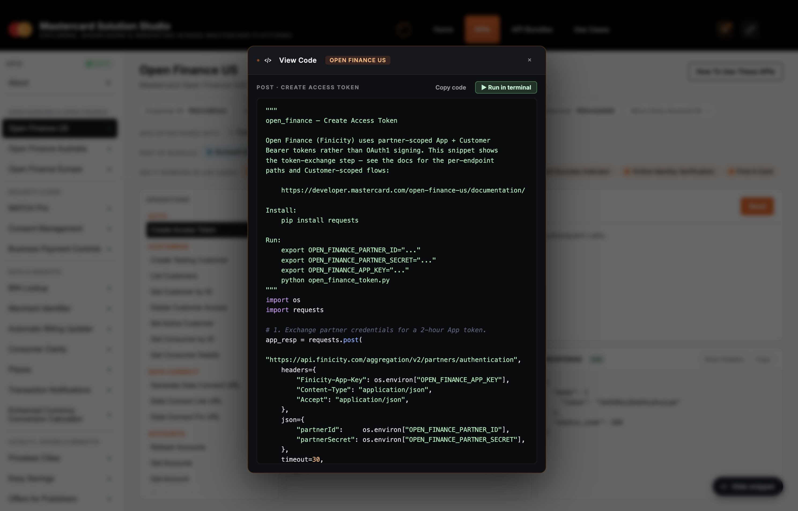
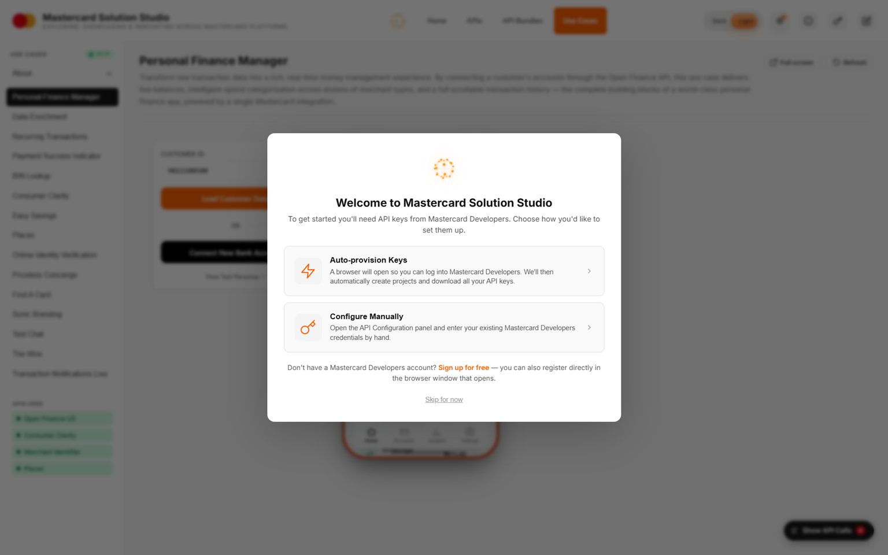
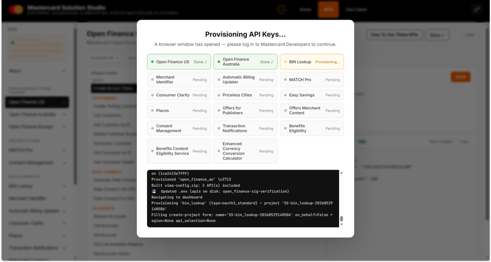

# Mastercard Solution Studio

A unified platform for exploring, showcasing and innovating across
[Mastercard APIs](https://developer.mastercard.com/) and use cases.

> **ViMA** = **Vi**becoding with **MA**stercard — the codename for the
> embedded AI coding assistant that lets you customise and extend use cases
> from inside the running app.


---

## What it does

Solution Studio wires up a curated set of Mastercard Developer APIs so they
"just work" out of the box, then layers a collection of **Use Cases** on top
to demonstrate, combine and innovate on those capabilities. An embedded
Claude-powered chat (ViMA) lets you edit any use case in place — no IDE
required.

### Wired-up APIs

All accessible from the **APIs** tab, grouped the same way they're
categorised on developer.mastercard.com. Each has full request/response
inspection, parameter forms, state chaining between operations and a
built-in simulator that can serve responses when no live keys are
configured.

#### Open Banking & Open Finance

| API | Auth | Notes |
|---|---|---|
| **Open Finance US** | OAuth 2.0 | Mastercard / Finicity US Open Banking — accounts, transactions, balances, reports (VOA / VOI / Cash Flow), Data Connect, ACH details. *US IP required.* |
| **Open Finance Australia** | OAuth 2.0 | Same Finicity stack, AU CDR variant. |
| **Open Finance Europe** | OAuth 2.0 (RSA-signed JWT client-assertion) | Aiia-backed EU stack — accounts, transactions, balances, insights. **Manual onboarding** — email `openbankingeu_support@mastercard.com` with your RSA-4096 public PEM to receive a sandbox `clientId`. |

#### Security & Risk

| API | Auth | Notes |
|---|---|---|
| **MATCH Pro** | OAuth 1.0a | Merchant Alert To Control High-Risk merchants — termination inquiry and lookup. |
| **Consent Management** | OAuth 1.0a + JWE | Card-on-file consent capture and 3DS step-up authentication. |

Consent Management quick flow (card enrollment + 3DS):

1. Run Create consent.
2. In the operation hint panel, click Launch 3DS Method. The launch card is pinned at the top of hints so it is visible first.
3. Complete the browser flow (fingerprint, and challenge/OTP only if prompted).
4. Return to the API explorer and run Start authentication.
5. Run Verify authentication.
6. Run Get consents and confirm consent status is APPROVED.

If Launch 3DS succeeds but verify does not:

1. Ensure you are using the same cardReference generated by the latest Create consent call.
2. Do not skip Start authentication before Verify authentication.
3. If the flow is in an invalid auth state, run Delete all consents for that cardReference, then restart from Create consent.
4. If using live mode (not simulator), confirm CONSENT_MANAGEMENT_ENCRYPTION_KEY_PATH is set and points to a valid PEM file.

#### Data & Insights

| API | Auth | Notes |
|---|---|---|
| **BIN Lookup** | OAuth 1.0a | Card range / BIN metadata. |
| **Merchant Identifier** | OAuth 1.0a | Merchant search by name / location. |
| **Automatic Billing Updater** | OAuth 1.0a | Card-on-file lifecycle inquiries; push notifications require ABU Push service registration. |
| **Consumer Clarity** | OAuth 1.0a + JWE | Enhanced merchant data, logos and categories. |
| **Places** | OAuth 1.0a | Mastercard Places merchant location data. |
| **Transaction Notifications** | OAuth 1.0a | Real-time transaction notifications. |
| **Enhanced Currency Conversion Calculator** | OAuth 1.0a | Mastercard daily FX rates + ECB reference rates for EU Reg 2019/518 disclosure. *Requires API Owner approval.* |
| **Carbon Calculator** | OAuth 1.0a + JWE | Transaction-level carbon footprint scoring + aggregates. **Manual onboarding** — needs Mastercard-issued CID + Legal Name + BIN range. |

#### Loyalty, Offers & Benefits

| API | Auth | Notes |
|---|---|---|
| **Easy Savings** | OAuth 1.0a | Card-linked offers and redemption. |
| **Priceless Cities** | OAuth 1.0a | Priceless Cities experiences. *Requires API Owner approval.* |
| **Offers for Publishers** | OAuth 1.0a | Card-linked offers for publisher channels. |
| **Offers Merchant Content** | OAuth 1.0a | Merchant content for offers. |
| **Benefits Eligibility** | OAuth 1.0a + JWE | Card benefit eligibility checks. *Requires API Owner approval.* |
| **Benefits Content Eligibility Service** | OAuth 1.0a + JWE | Searchable benefit content catalogue. |
| **Flight Delay Pass** | OAuth 1.0a + JWE | Eligibility + registrations. **Manual onboarding** — issuer must be provisioned as a FDP tenant (≈26 days) and the Client Key whitelisted. |

> APIs marked *Requires API Owner approval* show a green tag in the
> provisioning modal — keys can still be auto-provisioned but the API
> won't return 2xx until Mastercard's product owner approves the
> request. APIs marked **Manual onboarding** are disabled from
> auto-provisioning and surface a deep link to the appropriate
> onboarding channel.


### Authentic Python snippets

Every API operation can render an authentic Python snippet sourced from the
same request model Solution Studio uses internally. Open the **View code**
drawer from the APIs tab to:

- inspect the live Python example for the selected operation
- copy the snippet source directly
- click **Run in terminal** to launch a local terminal window that exports the
   required credentials, installs the snippet dependencies, runs the code, and
   pauses so you can inspect the output

This is useful when you want to go from "the API works in the explorer" to
"show me the exact Python I would run on a machine" without manually wiring
env vars or package installs.



### Built-in simulator

Every wired API has a matching handler under `simulator/handlers/` and
seed fixtures under `simulator/fixtures/`. You can toggle any API to
"simulated" mode at runtime via the admin endpoint:

```bash
curl -X POST http://localhost:9021/api-sim/admin/toggle \
  -H 'Content-Type: application/json' \
  -d '{"api":"benefits_eligibility","simulated":true}'
```

…or set `<ENV_PREFIX>_SIMULATED=1` in `config/.env` to make it stick
across restarts. Useful when you don't have entitlement for an API yet
but still want to demo the UI end-to-end.

> **Note on simulator scope.** The simulator is intentionally thin.
> Faithfully mocking every API surface is expensive to build and even
> more expensive to keep in sync with the live contracts — and there's a
> strong argument that use cases built on agents should be *sympathetic
> to the existing interfaces* rather than wire APIs up directly, which
> reduces the need for a deep simulator in the first place. The
> simulator earns its keep later in the lifecycle: once an idea
> crystallises and you need to probe real-world viability with data
> shapes the sandbox can't produce, a flexible sandbox you can seed with
> arbitrary test data becomes valuable. Until then, expect handlers and
> fixtures to cover the happy path only.

### Use Cases

Showcased under the **Use Cases** tab. Each is a self-contained scenario
that composes one or more of the APIs above:

- **Personal Finance Manager** — full PFM dashboard over Open Finance
- **Data Enrichment** — merchant enrichment with logos & categories
- **Recurring Transactions** — recurring payment detection
- **Payment Success Indicator (PSI)** — score the likelihood of payment success
- **BIN Lookup** — interactive BIN explorer
- **Consumer Clarity** — merchant search with rich content
- **Easy Savings** — browse and redeem card-linked offers
- **Places** — merchant location explorer
- **Online Identity Verification** — IDV flow demo
- **Specials** — themed offer collections
- **[Find A Card](https://github.com/orancummins/fac)** — card recommendation engine (separate repo, embedded)
- **Sonic Branding** — Mastercard sound experience
- **Finance In Colour** — visual spend analytics
- **Test Chat** — ViMA chat playground


### ViMA — Vibecoding with Mastercard

Click the pencil icon in the top bar of any use case to open the embedded
Claude chat. Ask it to tweak the UI, change the layout, add features —
edits are applied directly to the use case source and hot-reload in the
preview. Requires an Anthropic API key (see Setup).


---

## Setup

### 1. Clone & install

```bash
git clone https://github.com/orancummins/vima
cd vima
python -m venv .venv
# Windows
.\.venv\Scripts\Activate.ps1
# macOS / Linux
source .venv/bin/activate
pip install -r requirements.txt -r chat/requirements.txt
```

### 2. Run

```bash
# Windows
.\run.bat

# macOS / Linux
./run.sh
```

Solution Studio (including the ViMA chat) starts on a single port:
**http://localhost:9021**

ViMA chat is embedded directly in the main Flask app — no separate process
or port is needed.

#### Runtime modes

`run.bat` and `run.sh` pass through startup flags to `app.py`.

- `--server`
   - Locks sensitive configuration surfaces for web users.
   - Disables API Configuration UI actions.
   - Disables ViMA chat (`/chat`) in both UI and backend.

- `--non-us`
   - Forces non-US behavior for the session.
   - Disables **Open Finance US** APIs and any use cases that depend on Open Finance US.
   - Adds menu tooltips indicating these items would be enabled on a US IP.

Examples:

```bash
# macOS / Linux
./run.sh --server
./run.sh --non-us
./run.sh --server --non-us
```

```bat
:: Windows
run.bat --server
run.bat --non-us
run.bat --server --non-us
```

### 3. Configure API keys — one-click auto-provisioning

Click the **Save +** button in the top-right of the app. Solution Studio will
open a provisioning panel listing every wired API. The grid is colour-coded:

- **White checkbox, ticked** — auto-provisionable and not yet configured (default selection).
- **Green checkbox, ticked** — already has keys on disk. Untick to skip, tick again to re-provision and rotate the keys.
- **Disabled with "Manual onboarding" badge** — needs an offline approval flow (Open Finance EU, Flight Delay Pass, Carbon Calculator). Click the link in the notes to start the onboarding email/wizard.
- **"Requires API Owner approval" note** — auto-provisioning will succeed but live calls won't return 2xx until Mastercard's product owner approves the request.

Hit **Provision Selected APIs** and the automation:

1. Opens the Mastercard Developer portal in a headless browser
2. Creates a project, adds each selected API, and generates signing keys
3. Downloads the `.p12` / `.pem` files and writes credentials into `config/.env`
4. Updates `config/.env` **incrementally — one API at a time** as each provisioning completes (so a failure half-way doesn't lose the keys you already have)

No manual portal steps required — just wait ~60 seconds per API.

For OAuth 1.0a + JWE APIs such as **Consent Management**, the provisioner now
captures both the signing key material and the client-encryption PEM required
for live request flows.

Provisioned keys are usable immediately. If an API still returns
`Unauthorized`, treat that as a credential or entitlement issue rather than a
"wait a few minutes" activation delay.



Once you start the run, a progress screen streams per-API status cards and the live provisioning log. The action button stays pinned to the bottom of the modal so you never have to scroll to dismiss it.



The generated `.env` is rendered in catalog order, grouped by API with a `# <Display Name>` header and a blank line between blocks, so you can hand-edit it later without losing the structure.

Credentials are stored locally in `config/.env`. Use the **Export** button
to bundle keys for sharing (the `ANTHROPIC_API_KEY` is redacted from
exports for safety).

### 4. (Optional) Enable ViMA chat

ViMA uses Anthropic's Claude. To enable it:

1. Sign up at [console.anthropic.com](https://console.anthropic.com/)
2. Go to **Settings → API Keys** and create a new key (starts with `sk-ant-`)
3. Paste it into the **Claude Chat** section of Solution Studio's config
   panel

See Anthropic's
[getting started guide](https://docs.anthropic.com/en/docs/get-started)
for more detail.

### 5. (US Open Finance only) Use a US IP

Mastercard's US Open Finance APIs reject non-US source IPs. If you're
running outside the US, connect to a US VPN endpoint before exercising
those endpoints. The Open Finance tab and Use Cases that depend on it
will display a banner if a non-US IP is detected.

---

## Rotating or removing API keys

Run `clean_keys.py` to wipe all local credentials and — optionally — delete the
corresponding projects from the Mastercard Developers portal in one step:

```bash
python clean_keys.py
```

What it does:

1. **Deletes local key material** — `config/keys/*.p12`, `config/keys/*.pem`, `config/.env`, and any cached tool artifacts (`tools/mcd-key-automation/temp/`, output zips).
2. **Clears the running app** — if Solution Studio is open on `localhost:9021` it posts to `/config/purge` so the in-memory env-vars are cleared immediately (no restart needed).
3. **Optionally deletes portal projects** — prompts you before opening a browser. Uses `MCD_PORTAL_EMAIL` / `MCD_PORTAL_PASSWORD` from `config/.env` to log in automatically (same credentials used during provisioning); no manual typing required.

After cleaning, re-run `./addapi.sh <DOCS_URL>` (or the Copilot agent command) to reprovision fresh keys for any API.

---

## Extending the platform

### Add a new API (or fix an existing one)

Paste this into Copilot Chat (agent mode) — that's it:

```
Follow docs/agent-onboarding/autonomous-api-onboarding.md for <DOCS_URL>
```

**Example — MATCH Pro:**

```
Follow docs/agent-onboarding/autonomous-api-onboarding.md for https://developer.mastercard.com/match/documentation/
```

The agent works through three phases automatically:

1. **Phase 1** — Checks whether the API is already integrated (catalog, `apis/<id>/api.py`, simulator handler + fixture, provisioning mapping). If not, it implements everything.
2. **Phase 2** — Runs `./addapi.sh <DOCS_URL>` to provision a live Mastercard Developer project and write credentials to `config/.env` — zero manual portal interaction required for supported APIs.
3. **Phase 3** — Calls the live sandbox and must see `✅ PASS status=200` before it declares success.

See [docs/agent-onboarding/autonomous-api-onboarding.md](docs/agent-onboarding/autonomous-api-onboarding.md) for the full instruction the agent reads.

<details>
<summary>Manual steps (if you prefer to wire an API by hand)</summary>

1. Add a canonical entry in [apis/catalog.py](apis/catalog.py). This is the source of truth for API identity, auth type, docs URL, and display order.
2. Create `apis/<id>/api.py` exposing:
   - `MANIFEST` — `id`, `name`, `description`, `categories`, `operations`, `state_schema`
   - `execute(op_id, params) -> dict` returning `{success, data, error, request, response, state_updates, hints}`
   - optional `get_state()`, `is_configured()`
3. Add matching handler/fixture files under `simulator/handlers/` and `simulator/fixtures/`.
4. Add or verify the provisioning mapping in `tools/mcd-key-automation/providers/mastercard/api_config.py`.
5. Run contract validation before merging:

```bash
./.venv/bin/python tools/validate_api_contract.py
```

`apis/registry.py` loads APIs dynamically from the catalog — no manual registry edits needed.

</details>

### Add a new use case

Two patterns are supported:

**A. Inline UI** — typical for use cases that compose Mastercard APIs
directly. Add a folder under `usecases/<id>/` with `__init__.py`
(exposing `MANIFEST`), `index.html` and `style.css`. Register the
module name in [usecases/registry.py](usecases/registry.py).

**B. Embedded external project** — for use cases that wrap a separate
running app, see [usecases/findacard/](usecases/findacard/) for the
canonical example. It pulls and embeds
[github.com/orancummins/fac](https://github.com/orancummins/fac) as a
web UI inside Solution Studio. Copy that pattern to bring any other
external project into the platform.

---

## Architecture

```
Mastercard Solution Studio (port 9021, Flask)
├── apis/         ← wired Mastercard API integrations
├── usecases/     ← end-to-end demos composing those APIs
├── simulator/    ← optional response mocking for offline / no-key runs
└── chat/         ← ViMA — Claude-powered coding assistant (Blueprint at /chat)
```

The main Flask app serves the UI, proxies API calls, and hosts ViMA chat
as an in-process Blueprint — all on a single port. `run.bat` / `run.sh`
start one process and you're ready to go.

---

## License

Internal exploration / showcase project.

