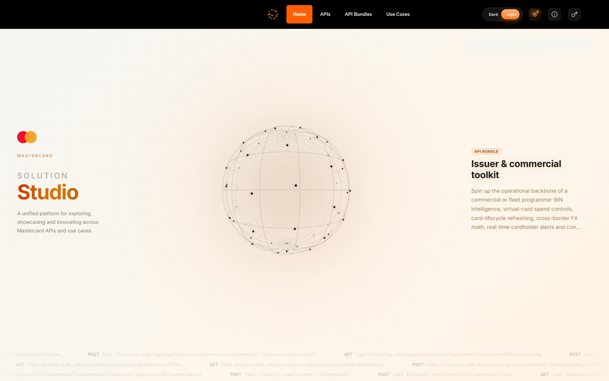
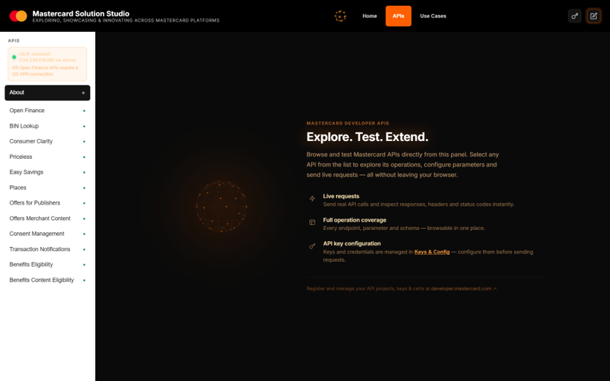
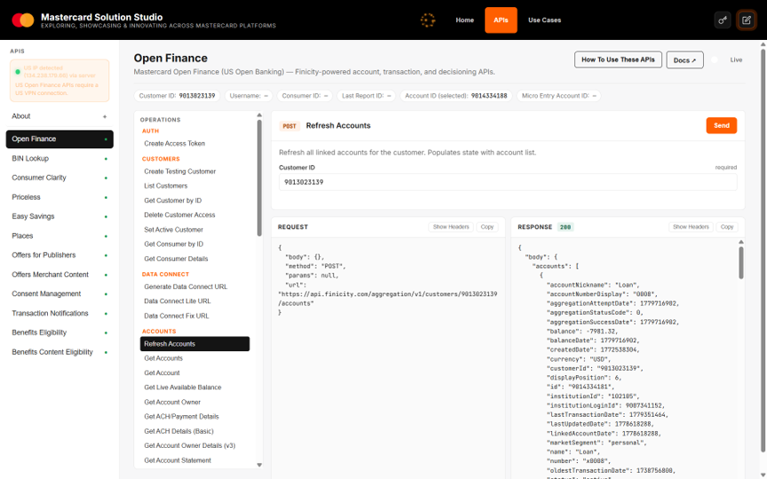
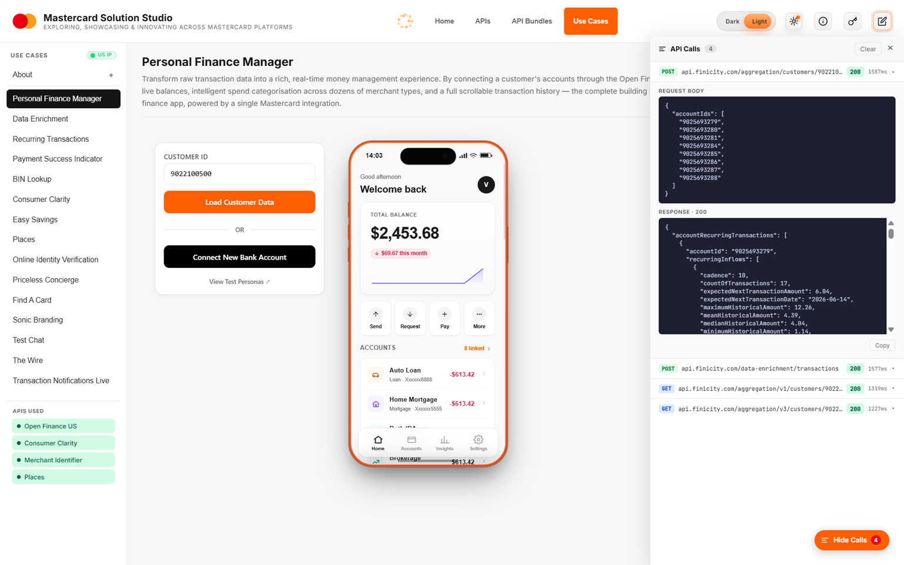
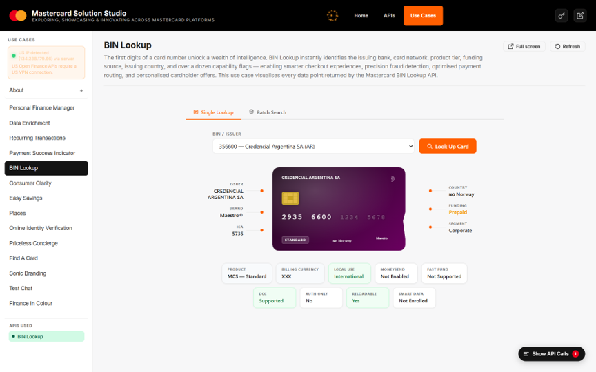
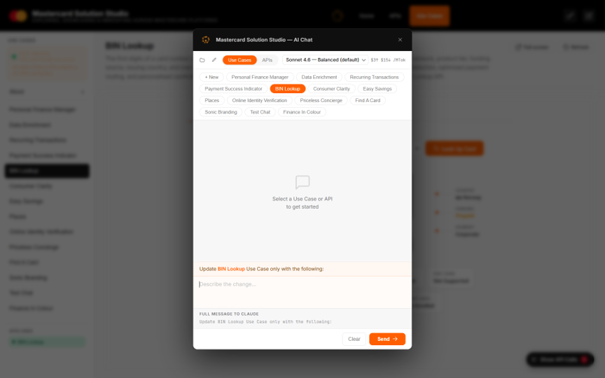

# Mastercard Solution Studio

A unified platform for exploring, showcasing and innovating across
[Mastercard APIs](https://developer.mastercard.com/) and use cases.

> **ViMA** = **Vi**becoding with **MA**stercard — the codename for the
> embedded AI coding assistant that lets you customise and extend use cases
> from inside the running app.



---

## What it does

Solution Studio wires up a curated set of Mastercard Developer APIs so they
"just work" out of the box, then layers a collection of **Use Cases** on top
to demonstrate, combine and innovate on those capabilities. An embedded
Claude-powered chat (ViMA) lets you edit any use case in place — no IDE
required.

### Wired-up APIs

All accessible from the **APIs** tab. Each has full request/response
inspection, parameter forms and state chaining between operations.

| API | Notes |
|---|---|
| **Open Finance** | Mastercard / Finicity US Open Banking — accounts, transactions, balances, reports (VOA / VOI / Cash Flow), Data Connect, ACH details. *US IP required.* |
| **BIN Lookup** | Card range / BIN metadata |
| **Consumer Clarity** | Enhanced merchant data and logos |
| **Consent Management** | Card-on-file consent capture and authentication |
| **Easy Savings** | Card-linked offers and redemption |
| **Benefits Eligibility** | Card benefit eligibility checks |
| **Benefits Content Eligibility** | Searchable benefit content catalogue |
| **Offers for Publishers** | Card-linked offers for publisher channels |
| **Offers Merchant Content** | Merchant content for offers |
| **Places** | Mastercard Places merchant location data |
| **Priceless** | Priceless Cities experiences |
| **Transaction Notifications** | Real-time transaction notifications |





### Use Cases

Showcased under the **Use Cases** tab. Each is a self-contained scenario
that composes one or more of the APIs above:

- **Personal Finance Manager** — full PFM dashboard over Open Finance
- **Data Enrichment** — merchant enrichment with logos & categories
- **Recurring Transactions** — recurring payment detection
- **Payment Success Indicator (PSI)** — score the likelihood of payment success
- **BIN Lookup** — interactive BIN explorer
- **Consumer Clarity** — merchant search with rich content
- **Easy Savings** — browse and redeem card-linked offers
- **Places** — merchant location explorer
- **Online Identity Verification** — IDV flow demo
- **Specials** — themed offer collections
- **[Find A Card](https://github.com/orancummins/fac)** — card recommendation engine (separate repo, embedded)
- **Sonic Branding** — Mastercard sound experience
- **Finance In Colour** — visual spend analytics
- **Test Chat** — ViMA chat playground





### ViMA — Vibecoding with Mastercard

Click the pencil icon in the top bar of any use case to open the embedded
Claude chat. Ask it to tweak the UI, change the layout, add features —
edits are applied directly to the use case source and hot-reload in the
preview. Requires an Anthropic API key (see Setup).



---

## Setup

### 1. Clone & install

```bash
git clone https://github.com/orancummins/vima
cd vima
python -m venv .venv
# Windows
.\.venv\Scripts\Activate.ps1
# macOS / Linux
source .venv/bin/activate
pip install -r requirements.txt -r chat/requirements.txt
```

### 2. Run

```bash
# Windows
.\run.bat

# macOS / Linux
./run.sh
```

Solution Studio (including the ViMA chat) starts on a single port:
**http://localhost:9021**

ViMA chat is embedded directly in the main Flask app — no separate process
or port is needed.

### 3. Configure API keys

Click the **key** icon in the top-right of the app to open the
configuration panel. Each API has its own section — paste your
Mastercard Developer credentials there and the changes take effect
immediately (no restart required).

For each Mastercard API you want to use:

1. Sign in at [developer.mastercard.com](https://developer.mastercard.com/)
2. Create a project, add the API, and download the signing `.p12` key
3. Paste the **Consumer Key** and upload the `.p12` file in the matching
   section of Solution Studio's config panel

Credentials are stored locally in `config/.env`. Use the **Export** button
to bundle keys for sharing (the `ANTHROPIC_API_KEY` is redacted from
exports for safety).

### 4. (Optional) Enable ViMA chat

ViMA uses Anthropic's Claude. To enable it:

1. Sign up at [console.anthropic.com](https://console.anthropic.com/)
2. Go to **Settings → API Keys** and create a new key (starts with `sk-ant-`)
3. Paste it into the **Claude Chat** section of Solution Studio's config
   panel

See Anthropic's
[getting started guide](https://docs.anthropic.com/en/docs/get-started)
for more detail.

### 5. (US Open Finance only) Use a US IP

Mastercard's US Open Finance APIs reject non-US source IPs. If you're
running outside the US, connect to a US VPN endpoint before exercising
those endpoints. The Open Finance tab and Use Cases that depend on it
will display a banner if a non-US IP is detected.

---

## Extending the platform

### Add a new API

1. Add a canonical entry in [apis/catalog.py](apis/catalog.py). This is the source of truth for API identity, auth type, docs URL, and display order.
2. Create `apis/<id>/api.py` exposing:
   - `MANIFEST` — `id`, `name`, `description`, `categories`, `operations`,
     `state_schema`
   - `execute(op_id, params) -> dict` returning
     `{success, data, error, request, response, state_updates, hints}`
   - optional `get_state()`, `is_configured()`
3. If the API has simulator support, add matching handler/fixture files under `simulator/handlers/` and `simulator/fixtures/`.
4. If the API should be auto-provisioned, add or verify its setup in `tools/mcd-key-automation/providers/mastercard/api_config.py` and ensure the matching `provision_type` exists in `tools/mcd-key-automation/providers/mastercard/workflows/project_workflow.py`.
5. Run contract validation (see `tools/validate_api_contract.py`) before merging.

```bash
./.venv/bin/python tools/validate_api_contract.py
```

Notes:
- `apis/registry.py` loads APIs dynamically from the catalog, so manual registry edits are no longer required.
- API Configuration fields are generated dynamically in [app.py](app.py) from catalog auth metadata.

For autonomous onboarding instructions and contract templates, start at [docs/agent-onboarding/README.md](docs/agent-onboarding/README.md).

### Add a new use case

Two patterns are supported:

**A. Inline UI** — typical for use cases that compose Mastercard APIs
directly. Add a folder under `usecases/<id>/` with `__init__.py`
(exposing `MANIFEST`), `index.html` and `style.css`. Register the
module name in [usecases/registry.py](usecases/registry.py).

**B. Embedded external project** — for use cases that wrap a separate
running app, see [usecases/findacard/](usecases/findacard/) for the
canonical example. It pulls and embeds
[github.com/orancummins/fac](https://github.com/orancummins/fac) as a
web UI inside Solution Studio. Copy that pattern to bring any other
external project into the platform.

---

## Architecture

```
Mastercard Solution Studio (port 9021, Flask)
├── apis/         ← wired Mastercard API integrations
├── usecases/     ← end-to-end demos composing those APIs
├── simulator/    ← optional response mocking for offline / no-key runs
└── chat/         ← ViMA — Claude-powered coding assistant (Blueprint at /chat)
```

The main Flask app serves the UI, proxies API calls, and hosts ViMA chat
as an in-process Blueprint — all on a single port. `run.bat` / `run.sh`
start one process and you're ready to go.

---

## License

Internal exploration / showcase project.

